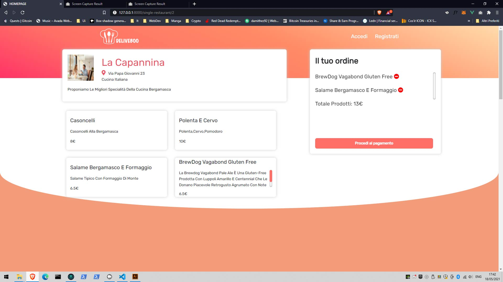
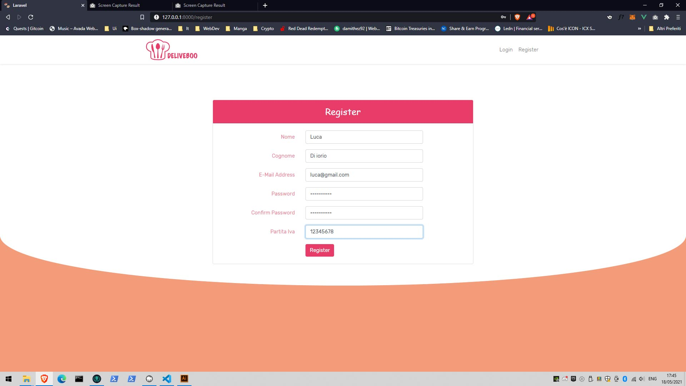
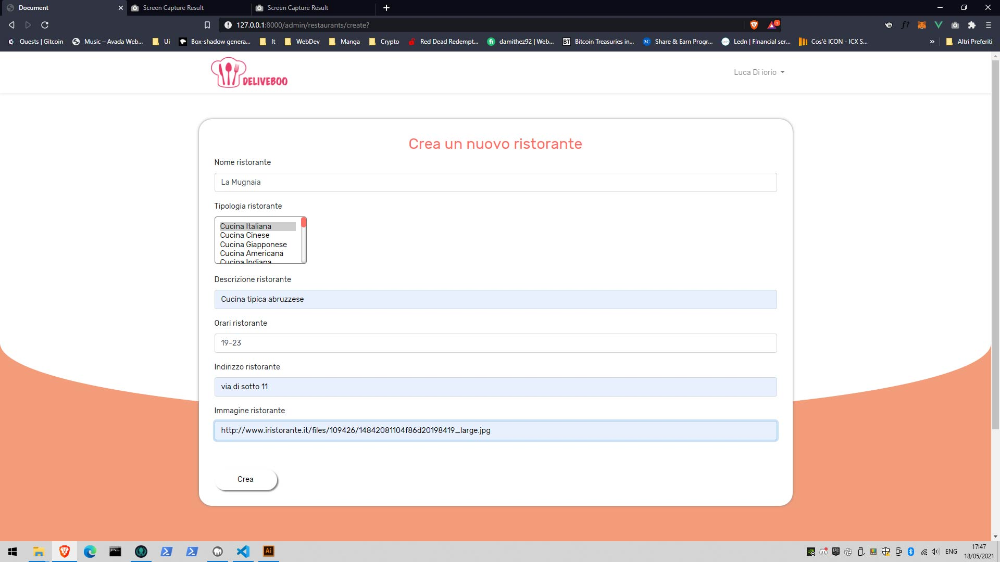
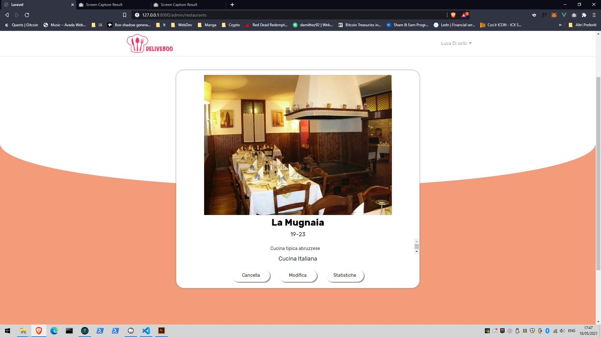
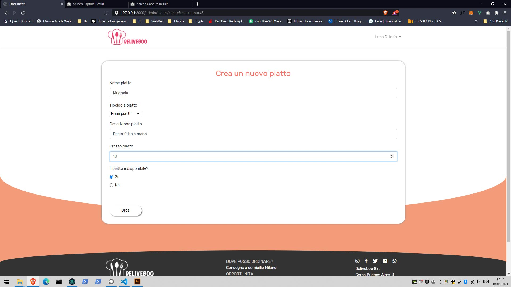
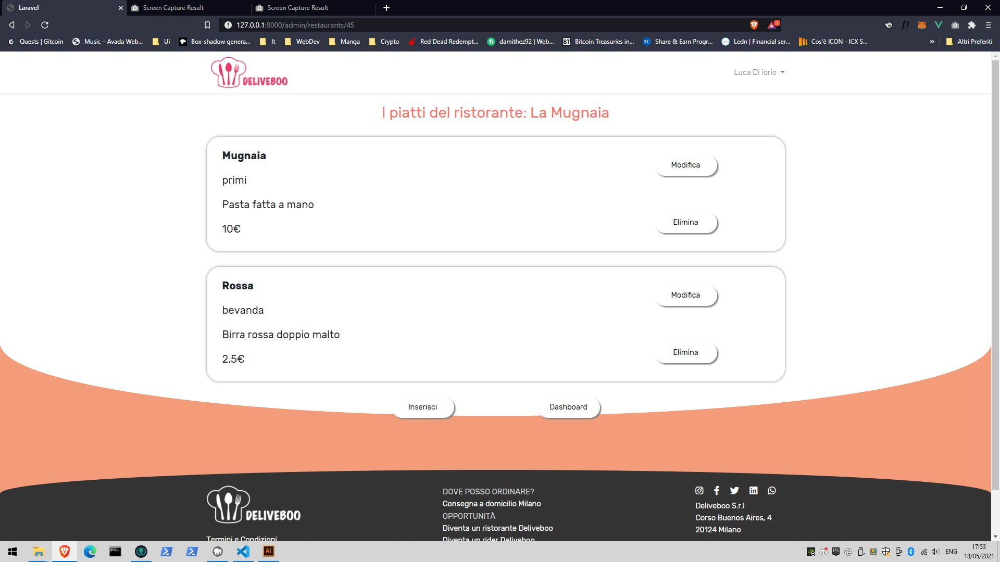
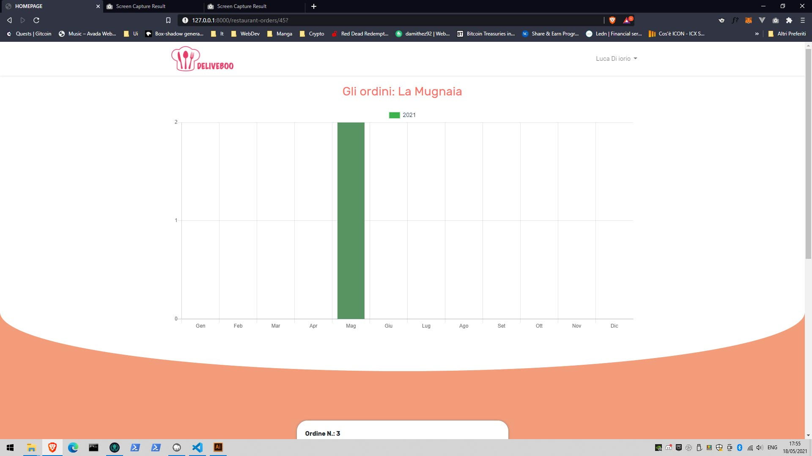
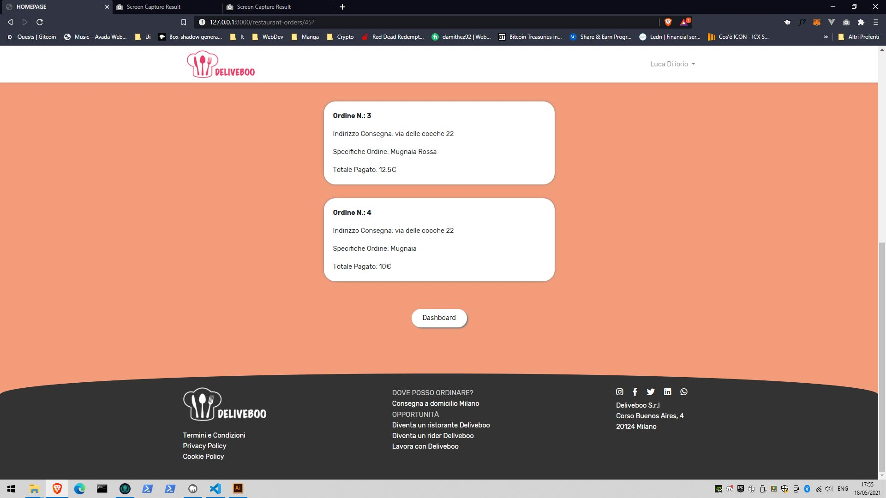

A food delivery app build with Laravel,Vue.js and Sass.This app can be used by 2 types of users: the customer and the restaurateur.The first one can buy food from his favourite restaurant without completing a registration, he just has to choose the restaurant, select the plates and pay the order to receive the food at his door.The restaurateur has to complete a registration process, after that he can register multiple restaurants, he can add or delete any plate he wants and he can cheque the order statistics for each of his stores.

